<div align="center">

# Horologie™

### The Atelier for Made-to-Order Luxury Timepieces

**A single-product, magazine-grade e-commerce experience built around a real-time watch configurator.**

_Swiss movement · Sapphire glass · Configured live · Shipped in 7-10 days_


</div>

---

## Overview

Horologie is a bespoke luxury watch storefront designed as an **atelier experience**, not a
catalog. Customers land on an editorial hero, walk through a seven-step configurator that
repaints a live 3D-style preview and repricing pipeline in real time, and place a made-to-order
request that flows into an admin console for the workshop.

The stack was hand-built end-to-end on **TanStack Start (React 19)** with a strict TypeScript
build, a Postgres database governed by row-level security, and a Playwright + Allure end-to-end
test harness that exercises every user-facing flow.

---

## Feature Tour

### 1. Editorial hero and kinetic marquee

Custom Fraunces / Inter Tight / JetBrains Mono type stack. Molten-ember accent, deep ink
background, hand-tuned Framer Motion micro-interactions.

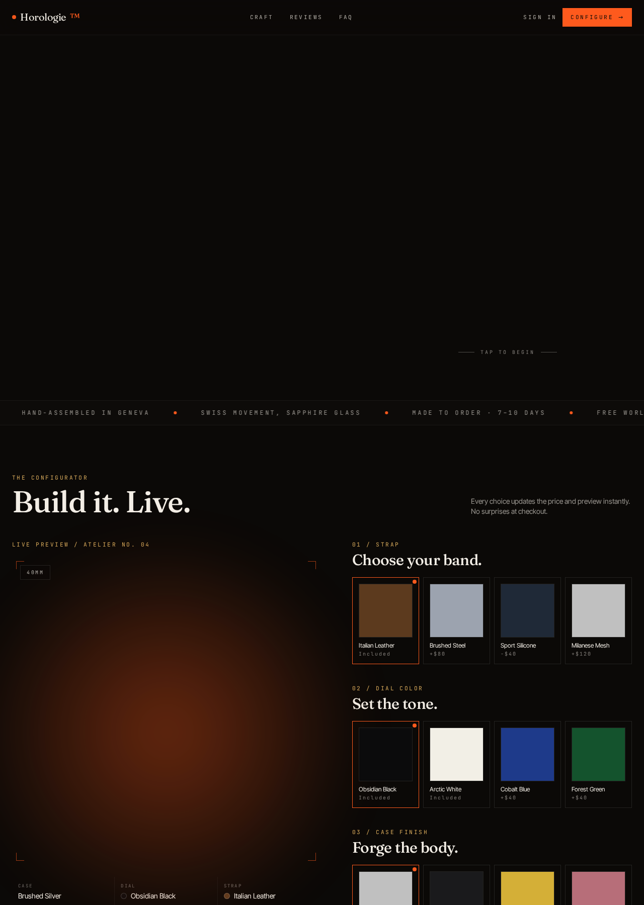

### 2. Live configurator — seven decisions, one price

Zustand-backed store, persisted to `localStorage`. Every option (strap, dial, case finish,
size, engraving, warranty, gift packaging) updates the animated preview, the modifier line
and the total simultaneously. Free 25-character engraving.

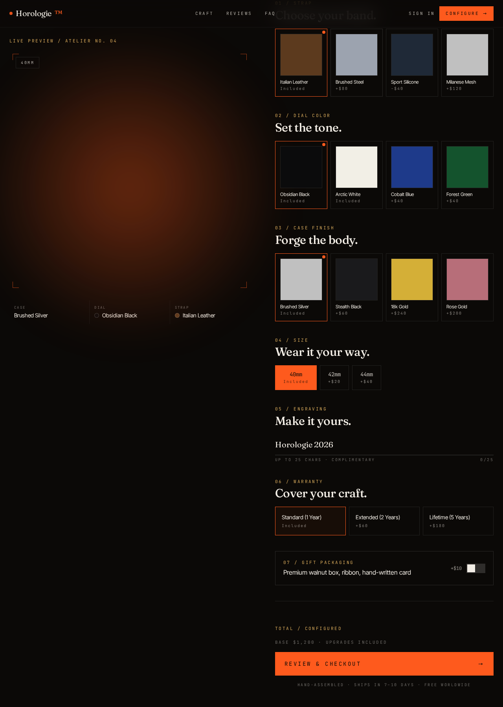
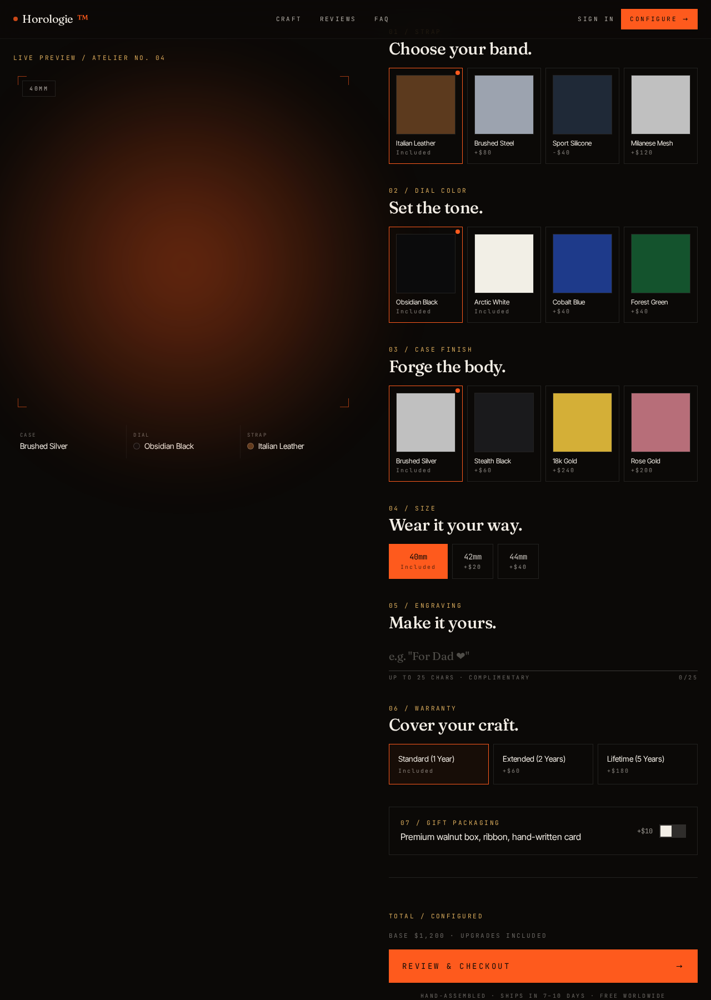

### 3. Atelier-grade sign in

Email + password AND managed Google OAuth via the Lovable Cloud broker. Password sign-in is
wired through the Supabase JS client; Google flows through `@lovable.dev/cloud-auth-js` so it
works identically in preview and on the custom domain.

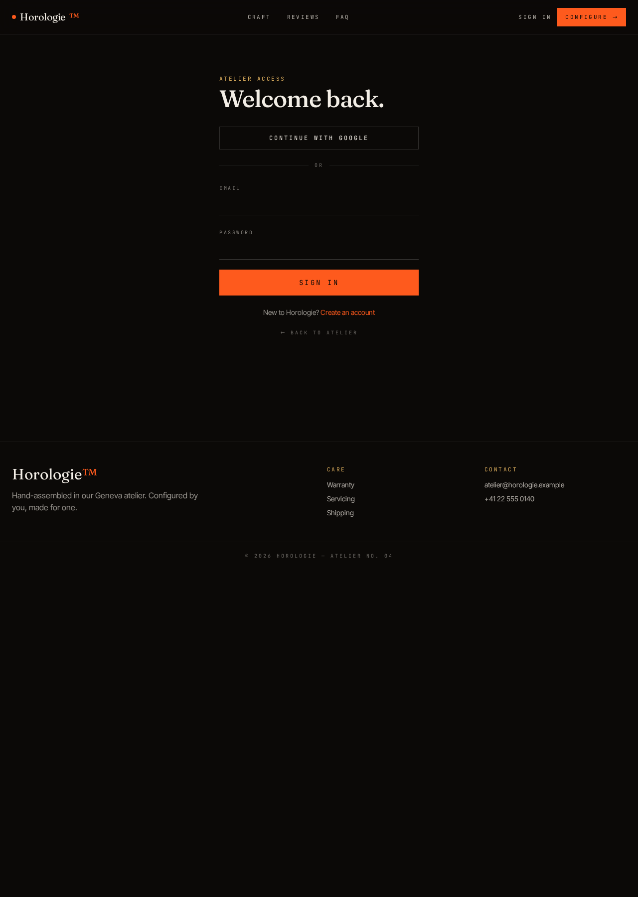
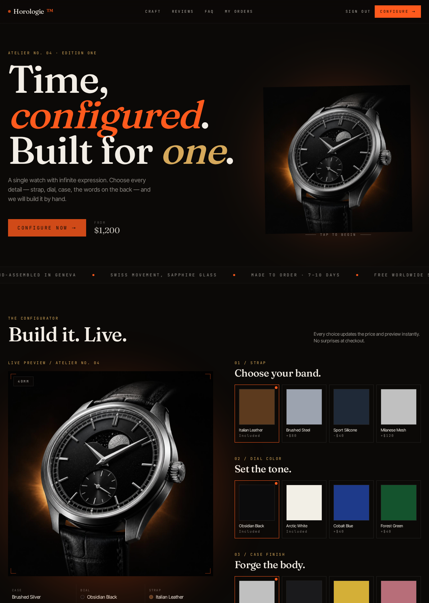

### 4. Review & mock checkout

A single-column checkout that mirrors the configured build on a sticky order summary card.
No card is collected — the order is written straight to Postgres inside a server function
with the full configuration snapshot for the workshop.

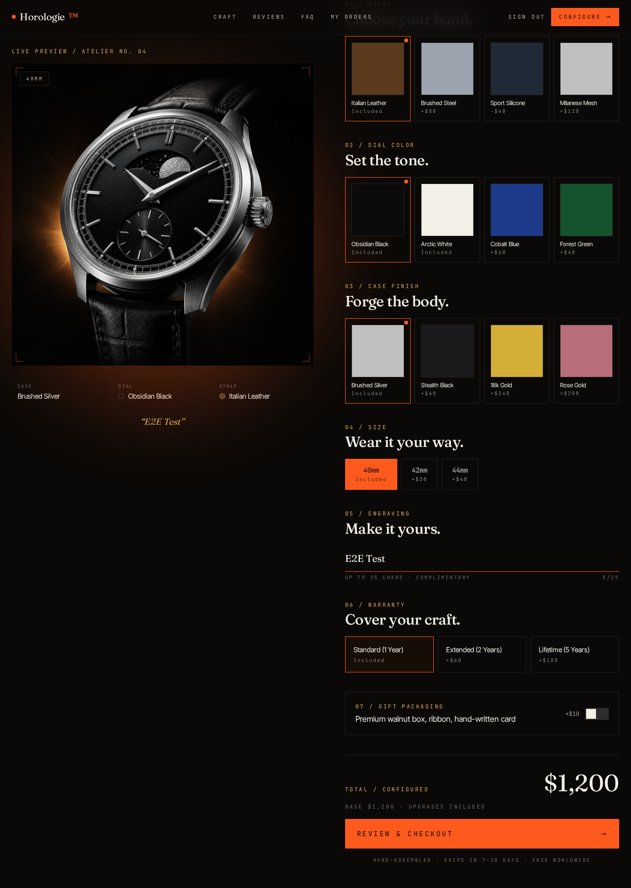
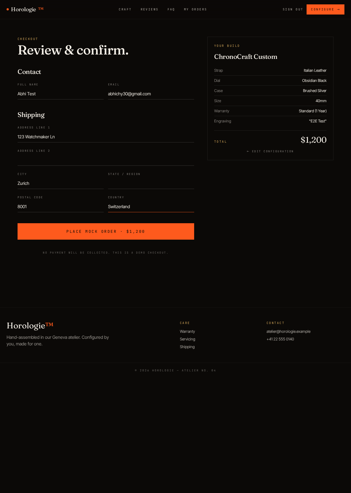

### 5. Order history and detail

Signed-in customers get a personal order log and a per-order confirmation view protected by
RLS on `orders` and `order_configurations`.


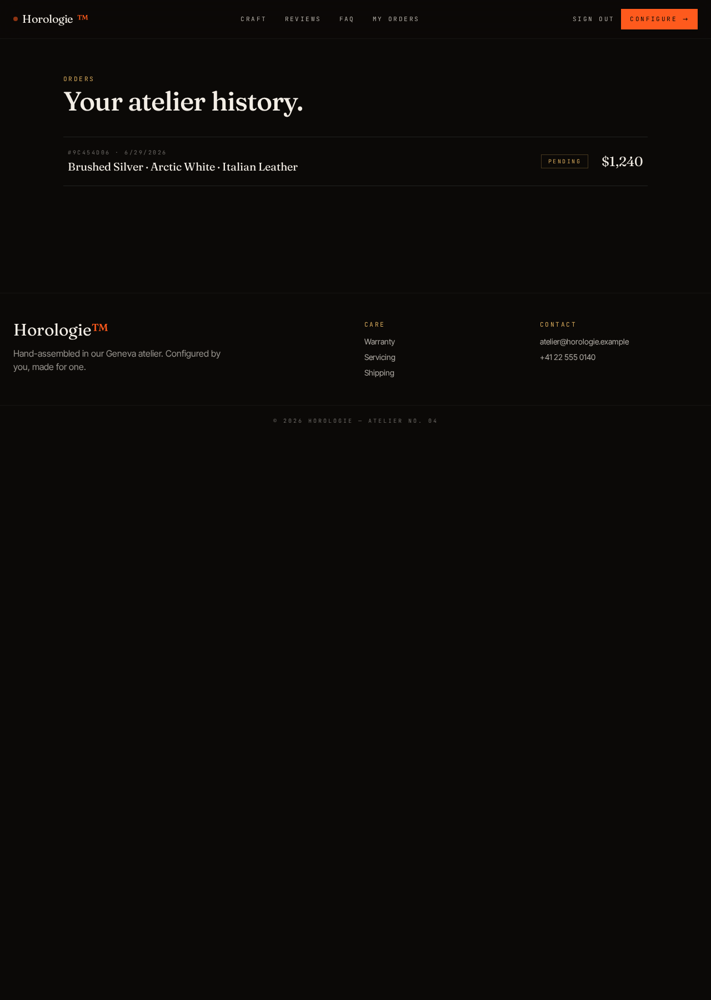

### 6. Admin console

A protected admin route surfaces every order across every customer for the workshop. Access
is gated by a security-definer `is_admin()` function so the check never runs client-side.

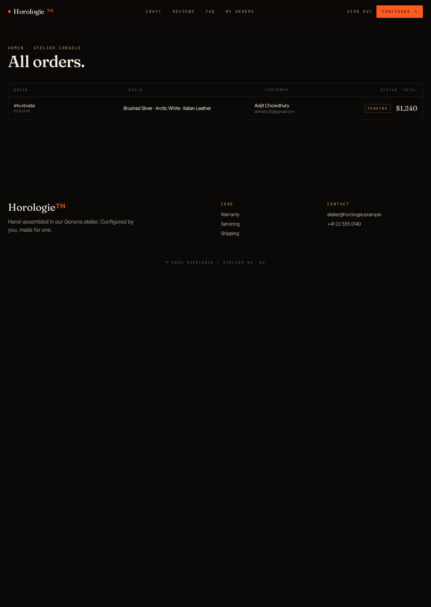

---

## Architecture

```
┌──────────────────────────┐        ┌───────────────────────────────┐
│  React 19 + TanStack     │        │  TanStack Start server layer  │
│  Router / Query          │──RPC──▶│  createServerFn handlers      │
│  Zustand store           │        │  Zod input validation         │
│  Framer Motion           │        │  Auth middleware (Supabase)   │
└──────────┬───────────────┘        └──────────────┬────────────────┘
           │ Publishable key                        │ Publishable + bearer
           ▼                                        ▼
     Supabase Auth  ◀──── Google OAuth ────▶  Postgres (RLS)
                                                │
                                                └── products, straps, dials,
                                                    orders, order_configurations,
                                                    profiles, testimonials, faq
```

### Data model highlights

- `products`, `straps`, `dial_colors`, `case_finishes`, `watch_sizes`, `warranty_options` —
  configurator catalog with `price_modifier` deltas.
- `orders` + `order_configurations` — signed-in orders with a full configuration snapshot
  so historical builds are immutable even if catalog prices change.
- `profiles` — auto-materialized on signup via a `handle_new_user()` trigger.
- `is_admin()` — `SECURITY DEFINER` helper referenced by RLS policies for admin routes.
- `testimonials`, `faq`, `settings` — CMS-lite tables driving the marketing surfaces.

### Security

- Row-level security enabled on **every** public table.
- `authenticated` role scoped to `auth.uid()` on user-owned rows.
- `service_role` reserved for privileged server-only helpers.
- No service-role secrets ever reach the client bundle; server-only modules are loaded via
  dynamic `import()` inside handlers.
- Password sign-in verified with Have I Been Pwned check (configurable).

---

## End-to-End Test Suite

A Python + Playwright test harness runs the six user-facing journeys and emits an Allure
report. Session bootstrap uses the Supabase REST auth endpoint so tests do not need a live
Google OAuth screen.

```
tests/e2e/
├── conftest.py          # Playwright + viewport fixtures
└── test_flows.py        # Six Allure-annotated tests
```

### Coverage

| # | Feature       | Scenario                                                            |
|---|---------------|---------------------------------------------------------------------|
| 1 | Landing       | Hero, configurator and footer render                                |
| 2 | Configurator  | Swatches, engraving, gift toggle update preview and price           |
| 3 | Authentication| Admin can sign in and header reflects session                       |
| 4 | Checkout      | Signed-in user configures, checks out and lands on an order page    |
| 5 | Orders        | Order history page renders for the signed-in user                   |
| 6 | Admin         | `is_admin()`-gated console lists every order                        |

### Running

```bash
# 1. Start the app
bun run dev            # http://localhost:8080

# 2. Run the E2E suite (emits Allure raw results)
python -m pytest tests/e2e --alluredir=allure-results

# 3. Generate + open the HTML report
allure generate allure-results -o allure-report --clean
allure open allure-report
```

### Result: 6 / 6 passing

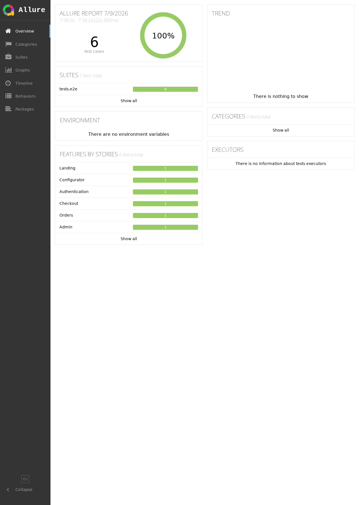

#### Suites
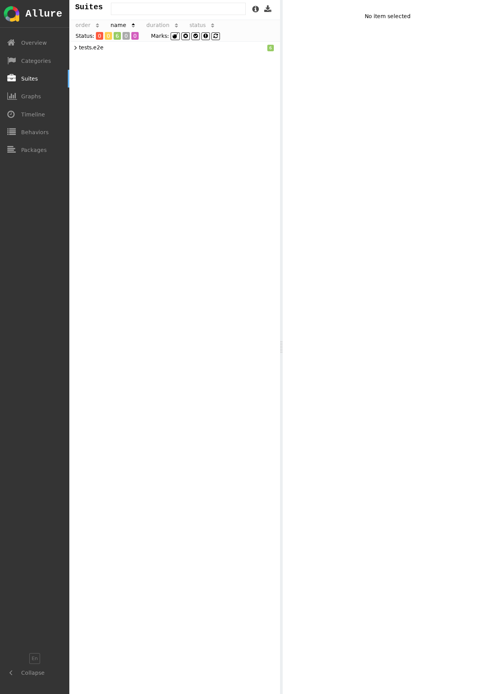

#### Behaviors (Features by Stories)
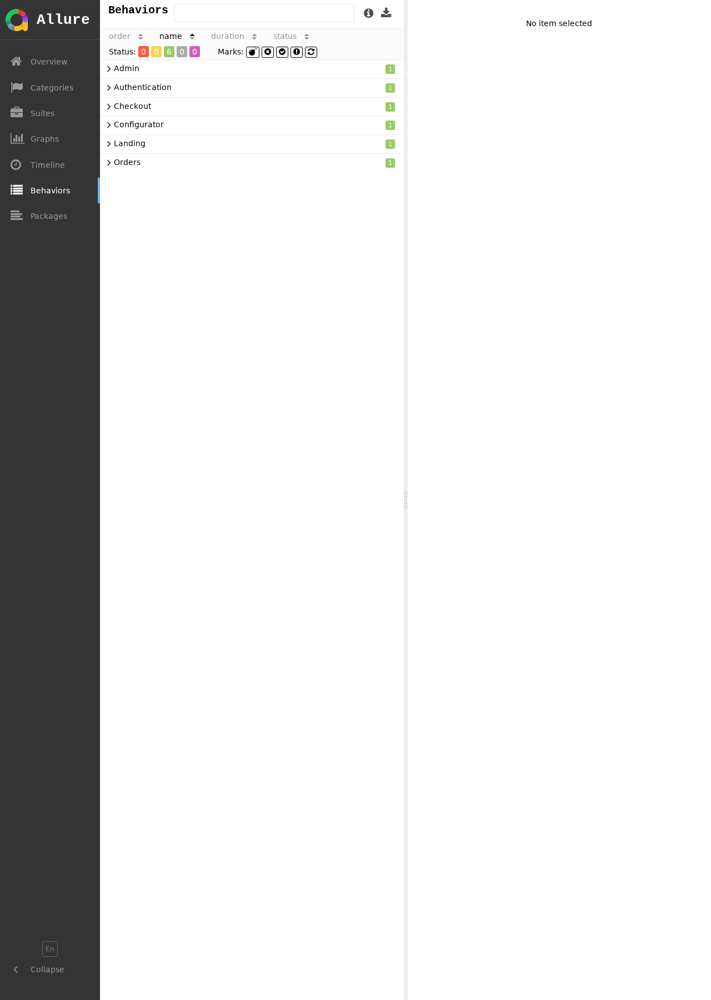

#### Graphs
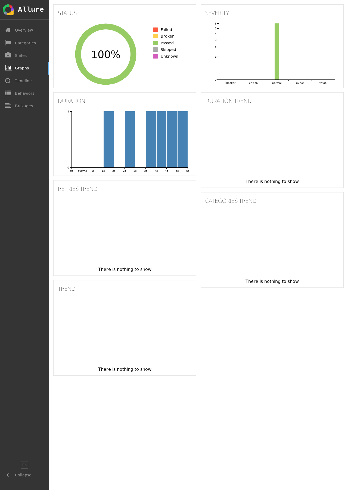

#### Timeline
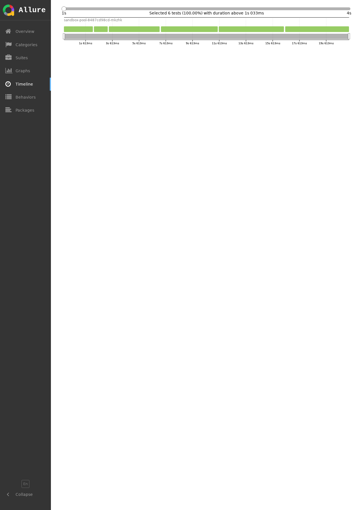

#### Categories
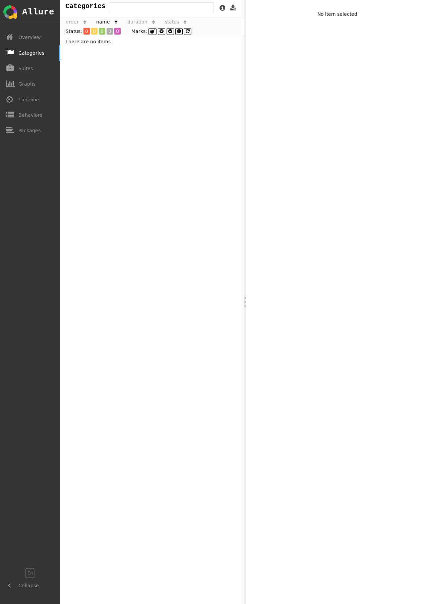

Every test attaches a full-viewport PNG at the meaningful assertion point, so the Allure
report doubles as living UI documentation.

---

## Tech Stack

| Layer            | Choice                                             |
|------------------|----------------------------------------------------|
| Framework        | TanStack Start v1 (React 19, Vite 7)               |
| Language         | TypeScript, `strict: true`                         |
| Styling          | Tailwind CSS v4 with a hand-authored token system  |
| State (client)   | Zustand (configurator), TanStack Query (server)    |
| Motion           | Framer Motion                                      |
| Validation       | Zod + React Hook Form                              |
| Auth             | Supabase Auth + Lovable Cloud OAuth broker (Google)|
| Database         | Postgres (Supabase) with row-level security        |
| Server logic     | `createServerFn` on the TanStack Start runtime     |
| Testing          | Playwright (Python) + `allure-pytest`              |
| Fonts            | Fraunces, Inter Tight, JetBrains Mono              |

---

## Local Development

```bash
bun install
bun run dev          # http://localhost:8080
bun run build:dev    # strict production-style build
bun run lint
```

Environment variables (see `.env`):

```
VITE_SUPABASE_URL=...
VITE_SUPABASE_PUBLISHABLE_KEY=...
VITE_SUPABASE_PROJECT_ID=...
```

Server-only secrets (`SUPABASE_SERVICE_ROLE_KEY`, `LOVABLE_API_KEY`, etc.) are injected at
runtime and never bundled to the client.

---

## Project Structure

```
src/
├── assets/                    # Hand-generated product photography
├── components/site/           # Header, footer, configurator, watch preview, marquee
├── integrations/
│   ├── lovable/               # Managed OAuth broker (auto-generated)
│   └── supabase/              # Client, admin, auth middleware, auth attacher
├── lib/
│   ├── catalog.functions.ts   # Read: configurator catalog
│   ├── orders.functions.ts    # Create / list / admin-list orders + is_admin gate
│   ├── configurator-store.ts  # Zustand store, persisted
│   └── format.ts              # Price formatting helpers
├── routes/
│   ├── __root.tsx             # Shell, fonts, SEO, auth sync
│   ├── index.tsx              # Landing + configurator + testimonials + FAQ
│   ├── auth.tsx               # Sign in / Sign up (email + Google)
│   ├── checkout.tsx           # Review + place order
│   ├── orders/                # /orders and /orders/:id
│   └── admin.tsx              # is_admin()-gated console
└── styles.css                 # Tailwind v4 tokens (ink / cream / ember)

tests/
├── e2e/                       # Python Playwright + Allure suite
│   ├── screenshots/           # Auto-captured UI evidence
│   └── allure-screenshots/    # Allure report captures
└── smoke/                     # Bun/Playwright smoke check

supabase/
└── migrations/                # Schema, RLS, seed data, is_admin helper
```

---

## Design Language

A deliberate rejection of default SaaS aesthetics. The palette is three tokens:

| Token   | Role                     | Value                       |
|---------|--------------------------|-----------------------------|
| `ink`   | Deep background          | Near-black with warm bias   |
| `cream` | Primary type + surfaces  | Warm off-white              |
| `ember` | Accent, CTAs, activity   | Molten orange               |

Typography uses Fraunces for editorial display headings, Inter Tight for body copy, and
JetBrains Mono for eyebrows and micro-labels — the same tension between serif gravitas and
mono precision you find in a real watch dial.

---

## License

Proprietary. All product photography, copy and design are original to this project.

<div align="center">

_Hand-assembled. Made to order. Shipped in 7-10 days._

</div>